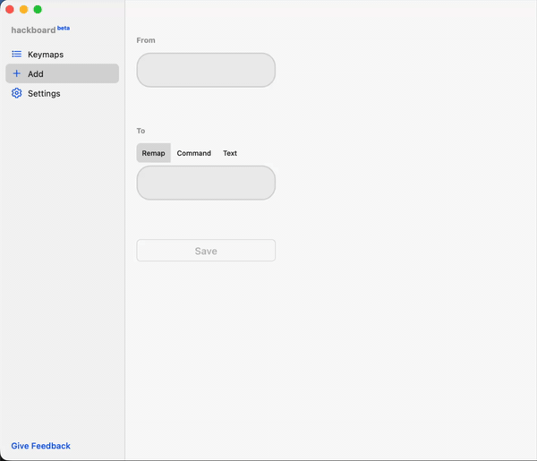
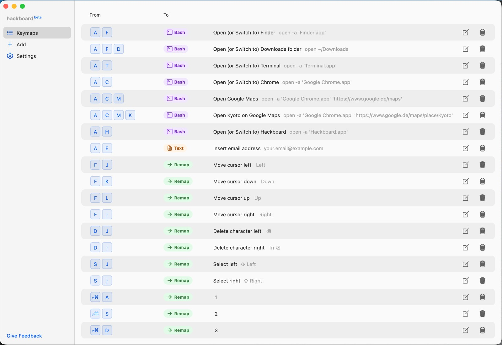

# Hackboard

Hackboard is a keyboard customization app for macOS. It enables namespaced and deeply layered shortcut systems by turning letter keys into modifiers — with smart rollover protecting your normal typing — letting you efficiently launch apps, remap keys or shortcuts, edit text, run shell commands, and more.

Built on [Karabiner Elements](https://karabiner-elements.pqrs.org/) by [Fumihiko Takayama](https://github.com/tekezo) — without his years of work on macOS keyboard customization, Hackboard would not exist. [Support his work](https://karabiner-elements.pqrs.org/docs/pricing/). Inspired by [Max Stoiber's Karabiner configuration](https://github.com/mxstbr/karabiner). Hackboard is driven by a custom fork (called Hb-Karabiner-Elements) with a visual editor on top, fully compatible with Karabiner-Elements, currently pinned to version 15.0.0.

## Security

Hackboard requires elevated system privileges for keyboard customization. Please review the [security information](SECURITY.md) before use. 

## Beta

Hackboard is in early beta and actively developed. You may encounter rough edges. Your feedback is what shapes the product — please [report bugs and share ideas](https://github.com/farbe-software/hackboard/issues).

## Capabilities

- **Letter keys as standalone modifiers** 
  E.g. holding `A`, then pressing and releasing `T` maps to an action, e.g. 'Open Terminal'. No prior modifier needed.
- **Smart rollover** 
  Using letter keys as modifiers normally requires holding them long enough that the system can tell you're not typing. Hackboard's smart rollover eliminates this delay — your normal typing is protected, even at speed.
- **Standard modifier + letter key chains** 
  E.g. holding Left ⌘, then holding `A` (for 'Application'), then pressing and releasing `T` (for 'Terminal') maps to the shell command `open -a Terminal.app`. This will open the app, or switch to it, if it is open. Standard modifiers and letter-key modifiers work together seamlessly.
- **Deep chaining** 
  Letter-key modifiers can be chained up to four levels deep (subject to hardware limitations on some machines). E.g. hold `A`, then `C` (Chrome), then `M` (Maps), then `K` (a specific location) — each level narrows the scope.
- **Right modifiers as independent keys** 
  Right ⌘, ⌥, ⌃, and ⇧ can be mapped separately from their left counterparts — e.g. hold Right ⌘ to type numbers from the home row, freeing you from reaching to the number row.
- **Action types** 
  Shell commands, remapped standard shortcuts in any app, and text insertion.

## Get Started

### Requirements

- macOS 13 (Ventura) or later (earlier versions may work but are not actively supported). 
- Apple Silicon (Intel builds may work but not actively supported)

### Install

Download the latest `.dmg` from the [Releases page](https://github.com/farbe-software/hackboard/releases/latest) and open the installer package inside it. The installer includes both Hackboard and Hb-Karabiner-Elements — no separate Karabiner download is needed.

> [!IMPORTANT]
> **Switching from Karabiner-Elements?** Uninstall it first and ensure your `karabiner.json` is compatible with Karabiner-Elements 15.0.0. If you're coming from an older version, you may benefit from migration instructions in the Hb-Karabiner-Elements UI. Downgrading from newer versions will need to be done manually.
> - If there are problems with permissions, try deactivating and reactivating them.
> - Your existing `karabiner.json` rules remain unaffected and will continue to work. If any of them conflict with your Hackboard keymaps, the Hackboard keymaps take priority.

### First Launch

After installation completes, **Hb-Karabiner-Elements** starts automatically and requests the necessary macOS permissions (Input Monitoring and a virtual HID driver approval). Follow the dialogs in the Hb-Karabiner-Elements UI until it no longer shows messages for missing permissions.

Once permissions are granted, **start Hackboard**. On launch, Hackboard runs an initial sanity check and asks for access to the folder containing `karabiner.json` via a system folder picker. Hackboard uses security-scoped bookmarks, so it cannot access files outside the granted folder without explicit user consent.

Once folder access is granted, Hackboard loads an example configuration showcasing its capabilities.

You can then add your first own keymaps through the sidebar, or edit and delete existing ones.

## Config Examples

### A-layer: Applications (with sublayers)

| Hold | Then press | Action |
|------|------------|--------|
| `A` | `C` | Open or Switch to Chrome |
| `A` `C` | `M` | Open Google Maps in Chrome |
| `A` `C` `M` | `K` | Open Google Maps in Chrome in a Specific Location|
| `A` | `F` | Open Finder |
| `A` `F` | `D` | Open Downloads folder |

### Arrow Actions (move/select/delete, vim-inspired)

#### F-layer: Move Cursor / Use Arrow Keys 

Hold `F` for moving the cursor / arrow keys, `S` and `D` for corresponding select and delete actions. The arrow keys are mapped to `J` `K` `L` `;` on the home row — inspired by vim's `hjkl`. Hit enter (on `Space`) and escape (on `A`) without stretching your pinky. 

| Hold | Then press | Action |
|------|------------|--------|
| `F` | `J` | Move cursor left |
| `F` | `K` | Move cursor down |
| `F` | `L` | Move cursor up |
| `F` | `;` | Move cursor right |
| `F` | `U` | Move cursor one word left |
| `F` | `P` | Move cursor one word right |
| `F` | `H` | Move cursor to line start |
| `F` | `'` | Move cursor to line end |
| `F` | `Space` | Enter |
| `F` | `A` | Escape |

Tap `F` by itself and it types "f" as usual.

#### S-layer: Selection 

Hold `S` to select text / items. Uses the same spatial layout as the F-layer, so the muscle memory carries over.

| Hold | Then press | Action |
|------|------------|--------|
| `S` | `J` | Select left |
| `S` | `K` | Select down |
| `S` | `L` | Select up |
| `S` | `;` | Select right |
| `S` | `U` | Select one word left |
| `S` | `P` | Select one word right |
| `S` | `H` | Select to line start |
| `S` | `'` | Select to line end |
| `S` | `F` | Select entire line |
| `S` | `A` | Select all |

### D-layer: Delete

Hold `D` to delete. Same spatial layout again — learn one, know all three.

| Hold | Then press | Action |
|------|------------|--------|
| `D` | `J` | Delete character left (Backspace) |
| `D` | `;` | Delete character right (Forward Delete) |
| `D` | `U` | Delete word left |
| `D` | `P` | Delete word right |
| `D` | `H` | Delete to line start |
| `D` | `'` | Delete to line end |
| `D` | `F` | Delete entire line |

### Number Row on Home Row

Hold Right ⌘ to type numbers from the home row, eliminating the reach to the number row.

| Hold | Then press | Result |
|------|------------|--------|
| `Right ⌘` | `A` | 1 |
| `Right ⌘` | `S` | 2 |
| `Right ⌘` | `D` | 3 |
| `Right ⌘` | `F` | 4 |
| `Right ⌘` | `G` | 5 |
| `Right ⌘` | `H` | 6 |
| `Right ⌘` | `J` | 7 |
| `Right ⌘` | `K` | 8 |
| `Right ⌘` | `L` | 9 |
| `Right ⌘` | `;` | 0 |

## Uninstall

A full uninstall can be triggered from the Hackboard settings page or through the Hb-Karabiner-Elements UI. Either option removes both applications. A restart is required to complete the uninstallation.

## Feedback & Issues

Found a bug or have a suggestion? [Open an issue](https://github.com/farbe-software/hackboard/issues) on this repository.

## Legal

By downloading and using Hackboard, you agree to the [Terms of Service](TERMS.md) and acknowledge the [Privacy Policy](PRIVACY.md).